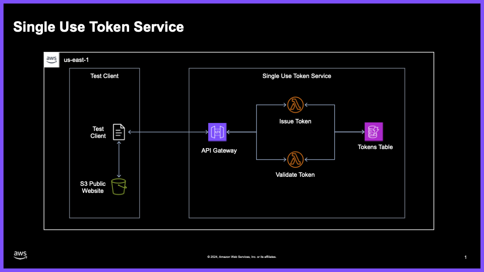

# One Time Use Token Service

## Overview

The Token Service provides a serverless solution for both issuing and validating one time use JWT tokens through a REST API. Built using AWS CDK, it leverages Amazon API Gateway, AWS Lambda, and Amazon DynamoDB for a scalable, highly available token management system.

## Architecture



* Amazon S3 - Hosts the static web interface
* Amazon API Gateway - Provides REST API endpoints
* AWS Lambda - Processes token issuance and validation requests
* Amazon DynamoDB - Stores token data, auto expires tokens not consumed by using the TTL feature of DDB

## Features

* One time token issuance with configurable expiration
* Token validation
* RESTful API for programmatic access
* Serverless architecture

## Getting Started

### Prerequisites
* AWS Account
* AWS CDK installed
* Python 3.9 or later
* Node.js 14.x or later

## Token Implementation

The Token Service utilizes standard JSON Web Tokens (JWT) to securely issue and validate one-time use tokens. These tokens are designed to be unique, tamper-proof, and expire after a predefined duration, ensuring robust security within the system.

### Token Structure

Each JWT consists of three parts: Header, Payload, and Signature.

- **Header**: Specifies the token type and the hashing algorithm used, such as HMAC SHA-256 (HS256).
    
- **Payload**: Contains the token claims, including:
    - `uuid`: A universally unique identifier (UUID) ensuring each token is distinct.
    - `exp`: The expiration time, set to 8 hours from the token's issuance, dictating the token's validity period.
    
- **Signature**: The token is signed using the HMAC SHA-256 algorithm with a secret key (`SECRET_KEY`). This signature ensures the token's integrity and prevents tampering or spoofing.

### Security Measures

- **HMAC Signature**: The HMAC (Hash-based Message Authentication Code) signature ensures that any alteration to the token's header or payload will render the signature invalid, thus preventing unauthorized modifications.

- **Unique Claims**: The inclusion of the `uuid` claim guarantees that each token is unique, mitigating the risk of token reuse or duplication.

### DynamoDB Integration

To enforce one-time use of tokens, DynamoDB is employed in the following manner:

- **Token Storage**: Upon issuance, each token's `uuid` and `expiry` are stored in the `TokenTable` DynamoDB table.

- **Single Use Enforcement**: When a token is validated, the corresponding `uuid` is deleted from the table, ensuring that the same token cannot be used again.

- **Time-to-Live (TTL)**: DynamoDB's TTL feature is configured on the `expiry` attribute, automatically purging unconsumed tokens after their expiration time. This ensures that stale tokens do not clutter the database and maintain optimal performance.

This combination of JWT's cryptographic guarantees and DynamoDB's robust data management ensures that tokens are secure, unique, and can only be used once within their valid timeframe.


## Deployment

1. Clone the repository:
```bash
git clone <repository-url>
```

2. Install dependencies:
```bash
python -m pip install -r requirements.txt
```

3. Deploy the stack:
```bash
cdk deploy
```

# API Reference

## Issue Token
Issues a new one time use token against the system.

**Request**
```http
GET /tokens
```

**Response**
```http
Content-Type: application/json

{
    "token": "abc123def456",
    "expiration": "2024-12-31T23:59:59Z"
}
```

**Status Codes**
* `200` - Successful issuance of a new one time use token
* `400` - Invalid request
* `500` - Server error

## Validate Token
Validates a provided token against the system.

**Request**
```http
POST /tokens
Content-Type: application/json

{
    "token": "your-token-here"
}
```

**Response**
```http
Content-Type: application/json

{
    "isValid": true,
    "message": "Token validation successful"
}
```

**Status Codes**
* `200` - Successful validation
* `400` - Invalid request
* `500` - Server error
